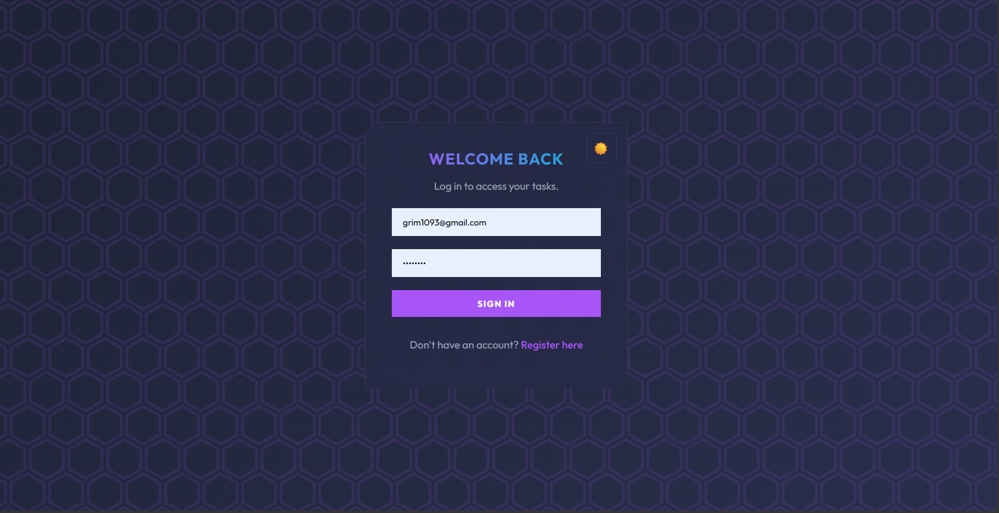
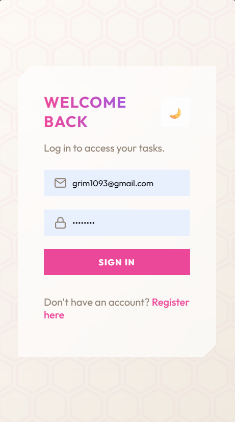
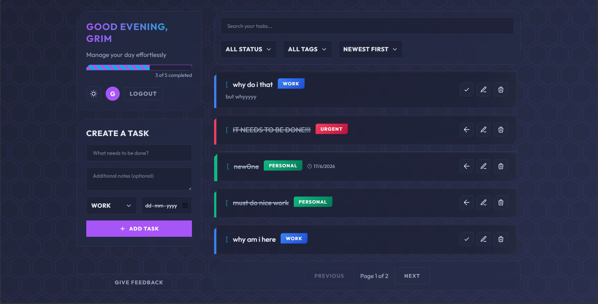
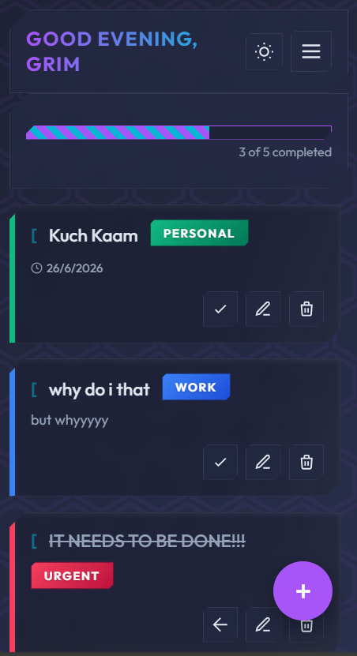
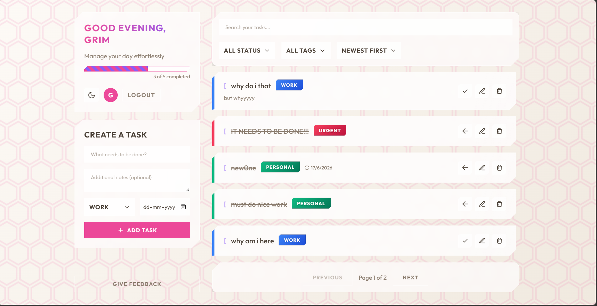
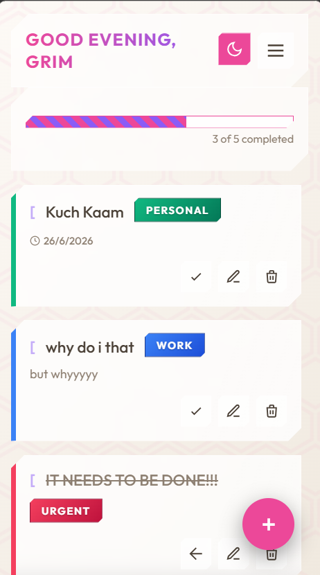
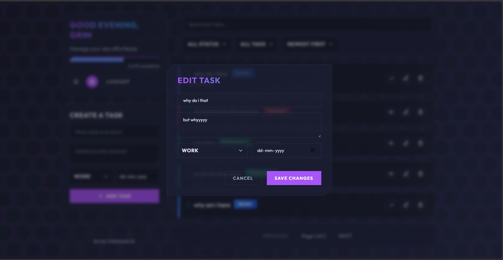
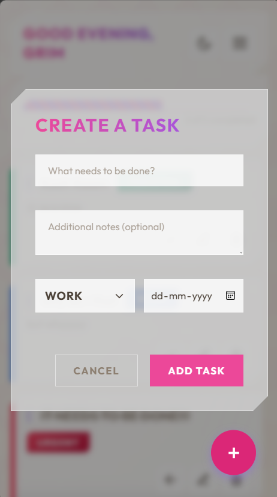

# Task Master - Premium MERN Stack Application

A full-stack Task Management Web Application built with the **MERN** stack (MongoDB, Express.js, React.js, Node.js). 
This project features a sleek, premium UI built from scratch using Vanilla CSS with a **Sharp Sci-Fi Tactical HUD**, responsive grids, gamified elements, and dynamic micro-animations.

## 🌟 Features

### Frontend (React + Vite)
- **Sharp Sci-Fi Tactical HUD**: Designed entirely from scratch using Vanilla CSS to feature custom Light/Dark mode themes, chamfered geometric panels, and tactical UI components. No generic component libraries used.
- **Gamification & Progress Tracking**: Features an animated, diagonal-striped "Daily Progress Bar" that calculates your completion ratio and fills up dynamically as you complete tasks.
- **Satisfying Micro-Animations**: Interactive elements come to life with scale-down "push" button effects, a strikethrough animation when completing tasks, and a bounce-in animation when tasks are added.
- **Color-Coded Task Tags**: Organize tasks with custom tags (`Work`, `Personal`, `Urgent`, `Other`). Tags are rendered as beautifully colored, pill-shaped badges.
- **Visual Urgency (Due Dates)**: Tasks feature deadline tracking. If a task is due today, it glows with a warm warning orange. If overdue, it pulses with a soft danger red, naturally drawing user attention.
- **Advanced State Tracking**: Toggle tasks between 'Pending' and 'Completed' states instantly.
- **Robust Searching & Filtering**: Cross-reference tasks by searching titles, filtering by completion status, AND filtering by specific tags simultaneously.
- **Pagination**: Efficiently paginates large lists of tasks to ensure performance.
- **Beautiful Empty States**: Utilizes custom SVG illustrations when the inbox is cleared to maintain a polished, professional feel.
- **Flawless Mobile Experience**: The layout intelligently reconstructs itself on mobile viewports. A Floating Action Button (FAB), a sleek Hamburger Menu for filters, and a dedicated top-bar ensure maximal screen real estate for your tasks.

### Backend (Node.js + Express.js)
- **RESTful API Architecture**: Organized cleanly with explicit Routes, Controllers, and Middleware.
- **Strict Data Validation**: The backend enforces Regex email format checking, minimum password lengths, and required task body content to prevent malformed data.
- **Secure Authentication**: Utilizes JWT (JSON Web Tokens) to secure user sessions via LocalStorage and bcryptjs for secure password hashing.
- **Protected Routes**: Ensures users can only query, manage, and view their own tasks.
- **MongoDB Integration**: Robust schemas for Users and Tasks defined via Mongoose.

## 🛠️ Technology Stack

- **Frontend**: React 19, Vite, React Router DOM, Axios, Vanilla CSS
- **Backend**: Node.js, Express.js, Mongoose, JWT, bcryptjs, CORS
- **Database**: MongoDB (Atlas)

---

## 🚀 Setup Instructions

### Prerequisites
Make sure you have [Node.js](https://nodejs.org/) installed on your machine.

### 1. Clone the repository
Navigate into the project directory:
```bash
cd Avden/AvMern
```

### 2. Backend Setup
1. Open a terminal and navigate to the backend directory:
   ```bash
   cd backend
   ```
2. Install the backend dependencies:
   ```bash
   npm install
   ```
3. Set up the `.env` file. Ensure there is a `.env` file in the `backend` folder with the following contents:
   ```env
   PORT=5000
   MONGO_URI=your_mongodb_connection_string
   JWT_SECRET=your_super_secret_jwt_key
   ```
4. Start the backend server:
   ```bash
   node server.js
   # OR for development with hot-reloading:
   npx nodemon server.js
   ```

### 3. Frontend Setup
1. Open a new terminal and navigate to the frontend directory:
   ```bash
   cd frontend
   ```
2. Install the frontend dependencies:
   ```bash
   npm install
   ```
3. Start the Vite development server:
   ```bash
   npm run dev
   ```

### 4. Open the App
By default, the Vite server will run on `http://localhost:5173`. Open this URL in your browser to view the application!

---

## 🌍 Deployment

### Deploying the Backend (Render)
1. Push the repository to GitHub.
2. Sign in to Render and create a new **Web Service**.
3. Connect your GitHub repository and set the root directory to `backend`.
4. Add the Environment Variables (`MONGO_URI`, `JWT_SECRET`).
5. Render will automatically build and start the server using `npm start`!

### Deploying the Frontend (Vercel)
1. Sign in to Vercel and create a new Project from your GitHub repository.
2. Set the Root Directory to `frontend`.
3. In the Environment Variables section, add `VITE_API_URL` pointing to your deployed Render URL (e.g., `https://your-api.onrender.com`).
4. Click Deploy! Vercel handles the Vite build automatically.

---

## 📸 Demo

### 🔐 Secure Authentication

<p align="center">
  
  
</p>

### 🌙 Tactical Dashboard (Dark Mode)

<p align="center">
  
  
</p>

### ☀️ Tactical Dashboard (Light Mode)

<p align="center">
  
  
</p>

### ✏️ Mission Briefing (Edit Modal)

<p align="center">
  
  
</p>

---

## 🧪 Evaluation Criteria Met
- **1. Code Quality**: Structured strictly into modular React components on the frontend, and distinct routers/controllers/models on the backend.
- **2. UI/UX**: Implements a custom, premium Sci-Fi HUD aesthetic avoiding all generic template look-and-feels. Includes thoughtful empty-states, sharp geometry, and a responsive tactical grid.
- **3. Functionality**: Full robust CRUD functionality alongside complex cross-filtering (search + status + tags + pagination).
- **4. Error Handling & Validation**: API errors are caught and surfaced via friendly UI alerts. Backend rigidly rejects poorly formatted emails, weak passwords, and empty payloads.
- **5. Creativity**: Standout features include the pulsing Honeycomb background, animated Gamification Progress Bar, Color-Coded Tag architecture, and dynamic "Visual Urgency" neon glows.

## Live Demo

Frontend:
https://av-mern.vercel.app

Backend:
https://avmern.onrender.com


## 🤝 Contributing
Feel free to open an issue or submit a pull request if you have any suggestions to improve the project!
